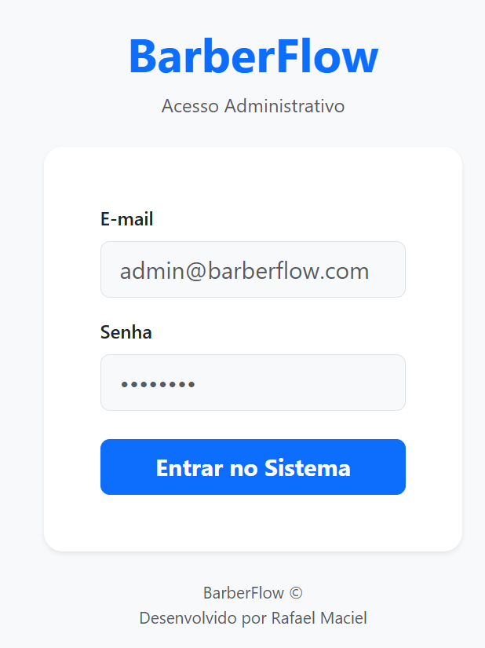
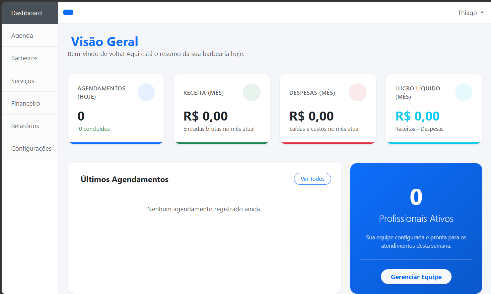
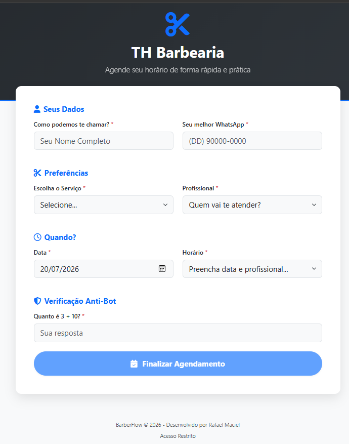
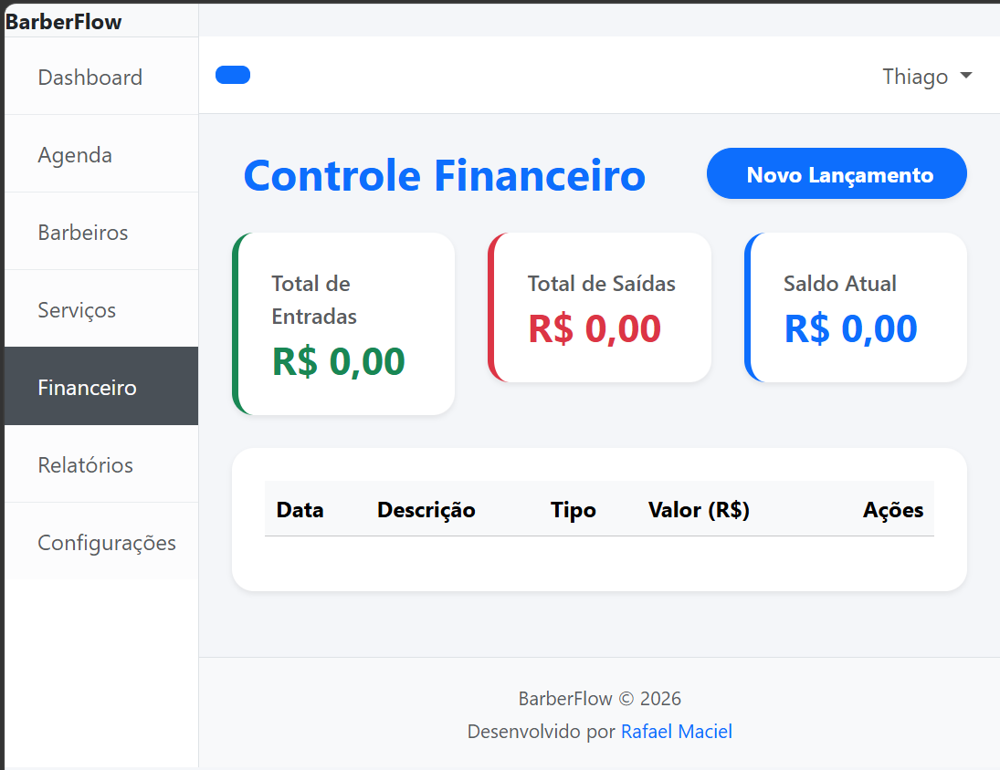

# ✂️ BarberFlow

<p align="center">


</p>

---

# 📖 Sobre o Projeto

**BarberFlow** é um sistema profissional para gerenciamento de barbearias, desenvolvido para oferecer uma experiência moderna, intuitiva e extremamente rápida.

O objetivo do projeto é atender desde barbeiros autônomos até barbearias com múltiplos profissionais, oferecendo controle completo sobre agendamentos, atendimento, financeiro e indicadores de desempenho.

O sistema foi projetado para evoluir futuramente para uma plataforma SaaS (Software as a Service), mantendo uma arquitetura organizada, escalável e preparada para crescimento.

---

# 🎯 Objetivos

- Simplicidade de uso
- Alto desempenho
- Interface moderna
- Arquitetura escalável
- Fácil instalação
- Fácil manutenção
- Código limpo
- Segurança
- Preparado para SaaS

---

# 🚀 Principais Funcionalidades

## 📅 Agendamento Inteligente

- Agendamento público
- Sem necessidade de cadastro de clientes
- Bloqueio automático de horários ocupados
- Bloqueio de horários passados
- Validação por operação matemática (anti-spam)
- Seleção de barbeiro
- Seleção de serviço
- Confirmação automática

---

## 👥 Gestão de Barbeiros

- Cadastro de barbeiros
- Foto
- Contato
- Status Ativo/Inativo
- Livre/Ocupado
- Habilitar ou desabilitar agendamento
- Controle de horários
- Controle de folgas

---

## ✂️ Gestão de Serviços

- Cadastro de serviços
- Valor
- Tempo de duração
- Serviço ativo/inativo

---

## 📊 Dashboard

Indicadores em tempo real:

- Agendamentos do dia
- Barbeiros livres
- Barbeiros ocupados
- Clientes aguardando
- Próximos atendimentos
- Serviços mais vendidos
- Faturamento diário
- Faturamento mensal

---

## ⏳ Fila de Atendimento (Painel de TV)

Atualização automática em tempo real.

Exibe:

- Vídeo do YouTube em exibição simultânea (configurável pelo Dashboard)
- Clientes em atendimento atual
- Próximos 3 clientes da fila
- Nome, Horário e Serviço

Pode ser utilizada em televisores da recepção.

---

## 💰 Financeiro

- Entradas
- Saídas
- Fluxo de caixa
- Receitas
- Despesas
- Fechamento diário
- Fechamento mensal

---

## 📈 Relatórios

- Financeiro
- Serviços
- Agendamentos
- Barbeiros
- Exportação PDF
- Exportação Excel

---

## ⚙️ Configurações

- Nome da Barbearia
- Logo
- WhatsApp
- Telefone
- Endereço
- SMTP
- Horário de funcionamento
- Dias fechados

---

## 📦 Instalador

Assistente de instalação contendo:

- Configuração MySQL
- Configuração SMTP
- Dados da empresa
- Criação do administrador
- Execução automática das migrations
- Execução automática dos seeders

---

# 🌐 Página Pública

O cliente **não precisa criar cadastro**.

Para realizar um agendamento basta informar:

- Nome
- WhatsApp
- Serviço
- Barbeiro
- Horário

Antes da confirmação será exibida uma operação matemática simples.

Exemplo:

```
7 + 5 = ?
```

Somente após responder corretamente o botão **Agendar** será liberado.

Após confirmar:

- grava no banco
- atualiza a fila
- envia e-mail ao barbeiro
- envia confirmação ao cliente

---

# 🖥️ Tecnologias

## Backend

- Laravel 13
- PHP 8.3+
- MySQL 8
- Eloquent ORM

---

## Frontend

- Bootstrap 5.3
- Blade
- JavaScript ES6
- AJAX
- jQuery

---

## Bibliotecas

- Bootstrap Icons
- Font Awesome
- SweetAlert2
- DataTables
- Select2
- FullCalendar
- Axios

---

# 🏗 Arquitetura

O projeto segue:

- MVC
- SOLID
- PSR-12
- Repository Pattern
- Service Layer
- Form Requests
- Blade Components

Os Controllers possuem apenas responsabilidade de receber requisições.

Toda regra de negócio é implementada na camada de Services.

---

# 📂 Estrutura do Projeto

```
barberflow/

app/
 ├── Enums
 ├── Helpers
 ├── Http
 │    ├── Controllers
 │    ├── Requests
 ├── Jobs
 ├── Mail
 ├── Models
 ├── Notifications
 ├── Observers
 ├── Policies
 ├── Repositories
 ├── Services
 └── Traits

bootstrap/

config/

database/

docs/

public/

resources/
 ├── css
 ├── js
 └── views

routes/

storage/

tests/

artisan

composer.json

package.json

vite.config.js
```

---

# 🗄 Banco de Dados

Principais tabelas:

- users
- settings
- barbers
- services
- appointments
- financial_transactions
- business_hours
- blocked_times

---

# 🛠️ Instalação

## 1 - Clonar o projeto

```bash
git clone https://github.com/SEU-USUARIO/barberflow.git
```

---

## 2 - Entrar na pasta

```bash
cd barberflow
```

---

## 3 - Instalar dependências PHP

```bash
composer install
```

---

## 4 - Instalar dependências JavaScript

```bash
npm install
```

---

## 5 - Copiar o arquivo de ambiente

Linux/Mac

```bash
cp .env.example .env
```

Windows

```powershell
copy .env.example .env
```

---

## 6 - Configurar o banco

Edite o arquivo:

```
.env
```

Configure:

```
DB_DATABASE=
DB_USERNAME=
DB_PASSWORD=
```

---

## 7 - Gerar chave

```bash
php artisan key:generate
```

---

## 8 - Executar migrations

```bash
php artisan migrate
```

---

## 9 - Executar seeders

```bash
php artisan db:seed
```

---

## 10 - Compilar os arquivos

Modo desenvolvimento

```bash
npm run dev
```

Produção

```bash
npm run build
```

---

## 11 - Iniciar servidor

Laragon

```
http://barberflow.test
```

Laravel

```bash
php artisan serve
```

---

# 📧 Configuração SMTP

Configure no `.env`:

```env
MAIL_MAILER=smtp
MAIL_HOST=smtp.exemplo.com
MAIL_PORT=587
MAIL_USERNAME=usuario@empresa.com
MAIL_PASSWORD=
MAIL_ENCRYPTION=tls
MAIL_FROM_ADDRESS=noreply@empresa.com
MAIL_FROM_NAME="${APP_NAME}"
```

Nunca envie credenciais reais para o GitHub.

---

# 🔒 Segurança

Nunca versionar:

```
.env
node_modules/
vendor/
public/build/
storage/logs/
storage/framework/*
bootstrap/cache/*
```

Jamais armazenar:

- Senhas
- Tokens
- Chaves PIX
- API Keys
- SMTP
- Cookies
- Sessões

Utilize sempre variáveis de ambiente.

---

# 📷 Demonstração

Crie a pasta:

```
docs/screenshots/
```

Exemplo:

```markdown








```

---

# 🛣️ Roadmap

## Versão 1.0

- Dashboard
- Agenda
- Serviços
- Barbeiros
- Financeiro
- Relatórios
- Página Pública

### Versão 1.1

- WhatsApp API
- Confirmação automática
- Cancelamento por link

### Versão 1.2

- Multiempresa
- Multiunidade

### Versão 2.0

- SaaS
- Assinaturas
- Pagamentos
- API REST
- Aplicativo Mobile

---

# 📋 Padrão de Commits

Utilizar Conventional Commits.

```
feat:
fix:
docs:
refactor:
style:
perf:
build:
test:
chore:
```

Exemplo:

```
feat: criar módulo de agendamentos

fix: corrigir conflito de horários

docs: atualizar README

refactor: reorganizar Services
```

---

# 🤝 Contribuição

Toda contribuição deverá seguir:

- PSR-12
- SOLID
- Clean Code
- Repository Pattern
- Service Pattern

Antes de cada commit execute:

```bash
php artisan optimize:clear
php artisan config:clear
php artisan route:clear
php artisan cache:clear
php artisan view:clear
npm run build
```

---

# 📄 Licença

Este projeto possui **Licença Comercial/Privada**.

Todos os direitos reservados.

A reprodução total ou parcial sem autorização é proibida.

---

# 👨‍💻 Desenvolvedor

Sistema desenvolvido por Rafael Maciel.

---

# ❤️ Agradecimentos

Obrigado por utilizar o BarberFlow.

Nosso objetivo é entregar uma solução moderna, rápida, segura e preparada para o crescimento da sua barbearia.

---

